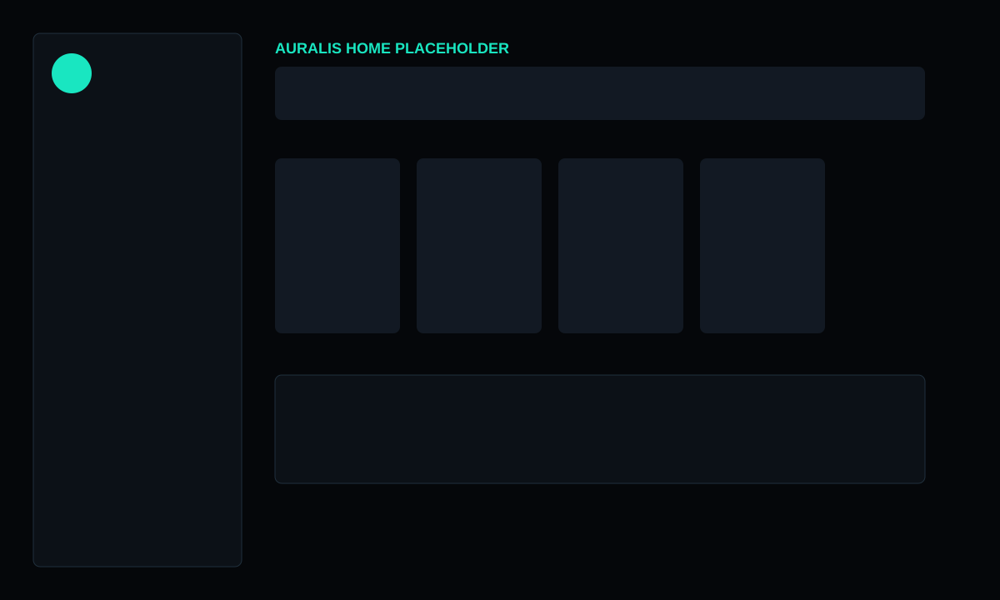
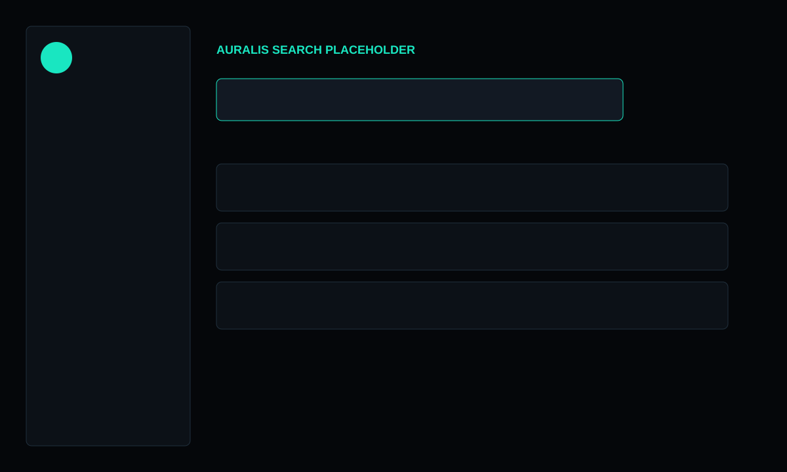

# Auralis

Auralis is a fullstack Spotify-inspired music dashboard built with React, Vite, Tailwind CSS, Node.js and Express. It keeps the original student project in `legacy-original/` and evolves it into a deploy-ready monorepo with a secure Spotify OAuth2 integration.




## Stack

- Frontend: React, Vite, Tailwind CSS, React Router, lucide-react
- Backend: Node.js, Express, Spotify Web API, OAuth2 Authorization Code Flow
- Security: Helmet, CORS allowlist, rate limiting, signed HTTPOnly cookies, OAuth state validation
- Tooling: ESLint, Prettier, GitHub Actions

## Structure

```txt
.
├── backend/
│   ├── src/
│   ├── tests/
│   └── .env.example
├── frontend/
│   ├── public/assets/
│   ├── src/
│   └── .env.example
├── legacy-original/
├── .github/workflows/ci.yml
├── SECURITY.md
└── README.md
```

## Spotify setup

1. Create an app in the Spotify Developer Dashboard.
2. Add this redirect URI:

```txt
http://localhost:5000/auth/callback
```

3. Copy the environment examples:

```bash
copy backend\.env.example backend\.env
copy frontend\.env.example frontend\.env
```

4. Fill `backend/.env`:

```env
PORT=5000
NODE_ENV=development
SPOTIFY_CLIENT_ID=
SPOTIFY_CLIENT_SECRET=
SPOTIFY_REDIRECT_URI=http://localhost:5000/auth/callback
FRONTEND_URL=http://localhost:5173
COOKIE_SECRET=replace-with-a-long-random-string
```

5. Confirm `frontend/.env`:

```env
VITE_API_URL=http://localhost:5000
```

## Run locally

Backend:

```bash
cd backend
npm install
npm run dev
```

Frontend:

```bash
cd frontend
npm install
npm run dev
```

Open `http://localhost:5173`, click **Login com Spotify**, authorize the app, and Auralis will load your profile, playlists, top tracks and search results through the backend.

## Build and start

Frontend:

```bash
cd frontend
npm run build
```

Backend:

```bash
cd backend
npm start
```

## API routes

Auth:

- `GET /auth/login`
- `GET /auth/callback`
- `POST /auth/logout`
- `GET /auth/me`

Spotify proxy:

- `GET /api/profile`
- `GET /api/playlists`
- `GET /api/playlists/:id`
- `GET /api/top-tracks`
- `GET /api/search?q=`
- `GET /api/player/recently-played`

## Notes

- The frontend never calls Spotify directly.
- Spotify tokens are not exposed to browser JavaScript.
- `.env` files are ignored by Git.
- `legacy-original/` preserves the initial HTML, CSS and JavaScript version.
